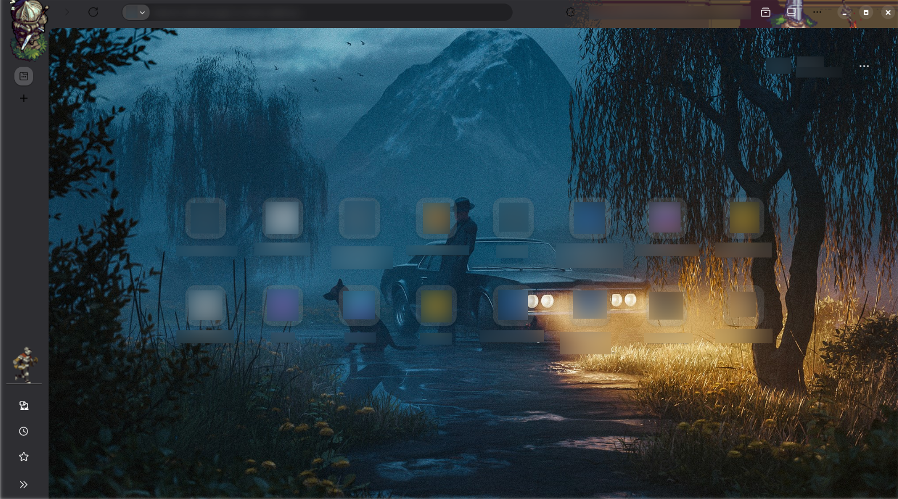

#  NewFox [Animated]
A minimal Firefox theme with userContent and userChrome.

 
 

 

🦊 I have Blurred my Pins, Weather, extensions and the searchbar in the Screenshot, it has nothing to do with the code.

##

##

> [!CAUTION] 
> On Firefox 152.0.0 in the search bar type about:config and make this "browser.nova.enabled" false

>[!TIP]
> - Check out the [main features](showcase.md)
>
> - Use vertical tabs

##

### How to Install

#### Step 1 - Download files

 - [Download](https://github.com/Mr-the-beginner/NewFox/releases/download/1.2.1/NewFox-V1.2.1.zip) and unzip theme files

#### Step 2 - Enabling some settigs

 - In the search bar type about:config and make these true =
 - privacy.userContext.enabled
 - toolkit.legacyUserProfileCustomizations.stylesheets
 - browser.newtabpage.activity-stream.nova.enabled (151.0.0 above only)

#### Step 3 - Installing the files

 - Type = about:support in the search bar.
 - Under "Application Basics", find "Profile Directory" and click "Open Directory" in front of it.
 - Come one directory below.
 - then copy the content of the "NewFox" directory as is inside and hit replace everything.

  #### Step 4 - Last touch
  
 - From where you are find the "profile" directory, go inside of it and delete the "startupCache" directory.
   
   

##

🚩 Release notes <i>[Click to expand]</i> 👇

 
 

1.2.0:
- Homescreen pins are now inspired by liquid glass
- Fixed some svg´s
- Added the toolbar animated items

1.1.0:
- Added the running Knight 
- Added userChrome.js to apply javascript
- Disabled some shortcuts that broke my layout (yeah instead of fixing the code i removed the firefox UI elements, call it a skill issue if you want 😇)

1.0.0:
- Based Theme

##

> [!CAUTION] 
> Look at this video if the vertical tabs is looking odd (not yet uploaded)

> [!NOTE]
> Disable "personalize-button.css" in the configs (just delete the file).
> 
> The pencil icon will get shown up in the home screen right corner.
>
> Toggled-on the weather widget then enable the file again (restore the file).
>
> The running knight is also only get shown in the currect position if the firefox is fullscreen, if not it will be displaced (i will fix it someday 😇)

> [!TIP]
> Now available at ([https://firefoxcss-store.github.io/](https://firefoxcss-store.github.io/themes/newfox/))

##

> I also used some code and assets that doesn't belong to me, expand the list below to see the direct link to there original owners.

  

✨ <b>Sources</b> <i>[Click to expand]</i> 👇

* 0.png, 1.png and 2.png are from this theme = https://addons.mozilla.org/en-US/firefox/addon/praisethesun/

* Icons folder, navbar.css and general.css are from = https://github.com/bmFtZQ/edge-frfox

*  Night-Swamp.jpg is the Adobe Premiere pro's 2023 splash screen = https://www.behance.net/gallery/163378813/Adobe-Premiere-Pro-Splash-Screen-2023/modules/921508831

*  The js loader is from = https://github.com/Aris-t2/CustomJSforFx

*  the 4.png is from = https://aamatniekss.itch.io/fantasy-knight-free-pixelart-animated-character

* liquid-glass inpired by = https://freefrontend.com/css-liquid-glass/

* Coin.png and Chest.png are from = https://itch.io

## Star History

Highest so far = 105
