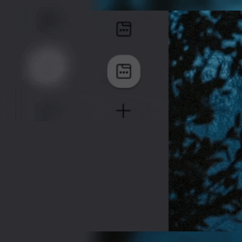
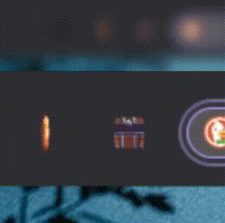
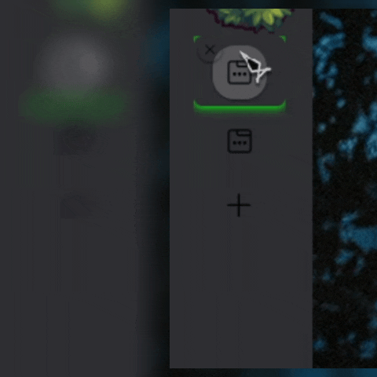
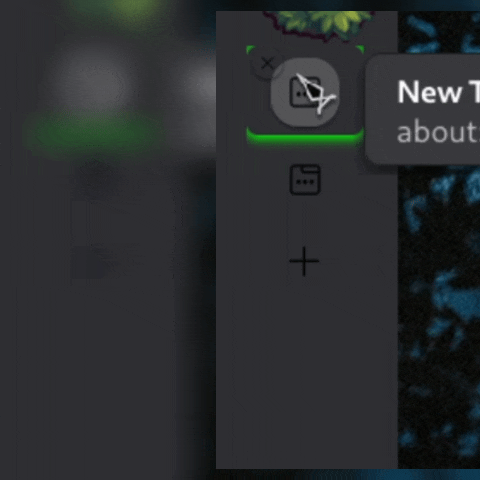
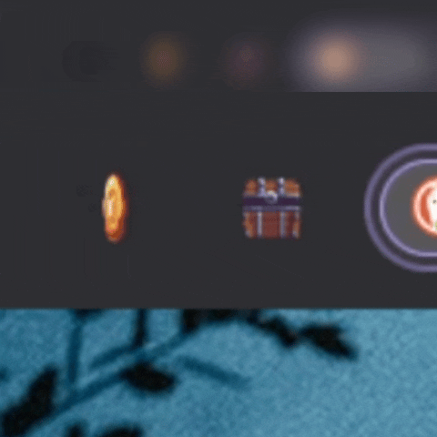
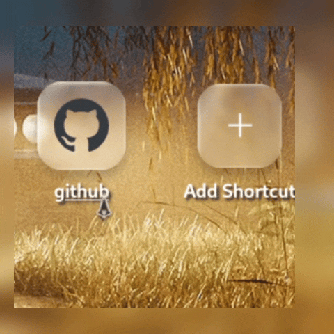

#### Previews

|Searchbar blur by unfocusing|Custom throbber|Sleeping knight at the toolbar and sidebar|Knight near campfire at the toolbar|
|--|--|--|--|
|||||
|Added at version 1.0.0|Added at version 1.0.0|Added at version 1.0.0|Added at version 1.0.0|

 

|Container tabs are round around the favicon|Glow indicator for active tab|Rotating close tab button|Running knight at the sidebar|
|--|--|--|--|
|||||
|Added at version 1.0.0|Added at version 1.0.0|Added at version 1.0.0|Added at version 1.1.0|

 

|Custom toolbar items looking like extentions with animated icons|Liqiud glass inspired home buttons|Color change after clicking a home button|
|--|--|--|
||||
|Added at version 1.2.0|Added at version 1.2.0|Added at version 1.2.0|
